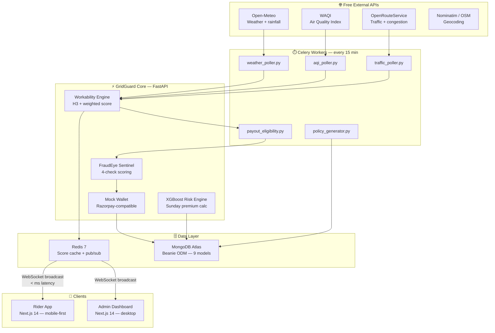
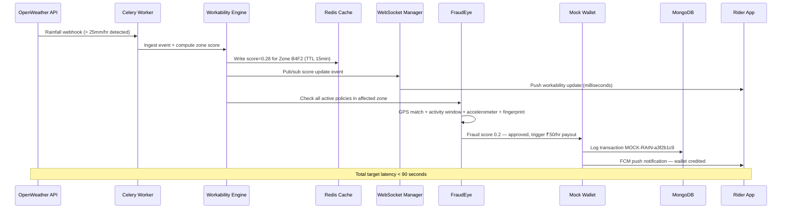
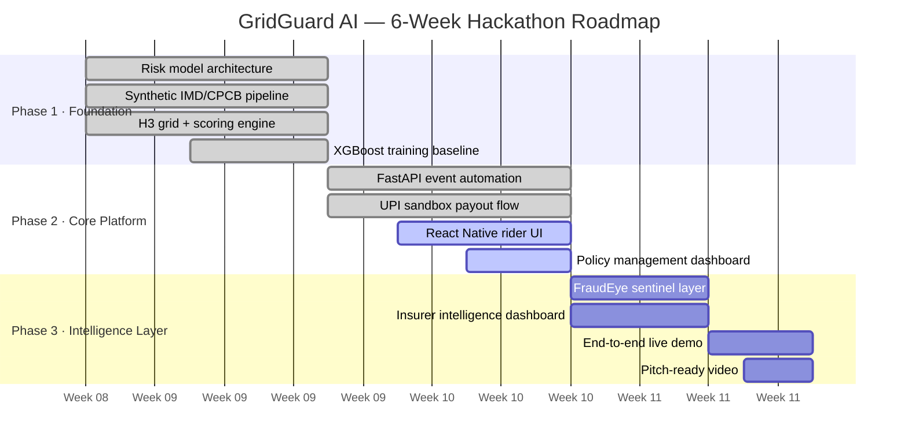

<div align="center">

# 🛡️ GridGuard AI

### *We're not building another insurance product.*
### *We're building income certainty for 5 million workers who have none.*

> **The weather doesn't wait. Neither should their payouts.**

<br/>

[](https://fastapi.tiangolo.com)
[](https://nextjs.org)
[](#)
[](#)
[](#)

<br/>

| ⚡ Payout Time | 📍 Grid Precision | 👥 Workers Targeted | 💳 Min. Weekly Premium |
|:-:|:-:|:-:|:-:|
| **< 90 seconds** | **500m × 500m hex** | **5 million+** | **₹12 / week** |

<br/>

When a flash flood hits Bengaluru, a Swiggy rider doesn't file an insurance claim.<br/>
He doesn't call a hotline. He doesn't upload photos of flooded roads.<br/><br/>
**He gets a notification. ₹150 just landed in his wallet. In 90 seconds. Automatically.**

</div>

---

## 📋 Table of Contents

| Section | Section |
|---|---|
| [🚨 The Problem](#-the-problem) | [✨ Key Features](#-key-features) |
| [🧑 Meet Ramesh](#-meet-ramesh) | [🛠️ Tech Stack](#%EF%B8%8F-tech-stack) |
| [⚡ How It Works](#-how-it-works) | [📡 API Modules](#-api-modules) |
| [🏗️ Build Status](#%EF%B8%8F-build-status) | [🚀 Getting Started](#-getting-started) |
| [🏛️ System Architecture](#%EF%B8%8F-system-architecture) | [🔐 Environment Variables](#-environment-variables) |
| [📁 Project Structure](#-project-structure) | [🌍 Deployment](#-deployment) |
| [🆚 Why GridGuard Wins](#-why-gridguard-wins) | [🔮 Roadmap](#-roadmap) |

---

## 🚨 The Problem

India's gig economy is massive. And completely unprotected.

**5 million+ delivery partners** work for Zomato, Swiggy, Zepto, and Blinkit. They're paid per delivery — which means when they can't ride, they earn nothing. Flash floods, dangerous AQI, extreme heat, and road chaos happen every single day. And every time they do, riders lose income with zero recourse.

Traditional insurance has completely failed this group for three reasons:

- 🚫 **No employer-employee relationship** → no employer cover exists
- 🕐 **Claims take 7–30 days** → the income is already gone by then
- 💸 **Premiums built for salaried workers** → unaffordable for daily wage earners

The result? A **₹4,200 Cr market with near-zero penetration.**

| Metric | Reality |
|---|---|
| Gig delivery workers in India | 5 million+ |
| Income protection products available to them | **Near zero** |
| Average income lost per rain event | ₹200–₹400 per worker per day |
| Extreme weather days recorded in 2023 (IMD data) | 147+ |
| AQI alerts above 300 → effective downtime per event | 3–5 work-hours |
| Traditional insurance claim processing time | 7–30 days |
| **GridGuard AI payout time** | **< 90 seconds** ✅ |

---

## 🧑 Meet Ramesh

> *This isn't an abstraction. Here's exactly what happens to a real rider — and what changes with GridGuard.*

**Ramesh Kumar, 31** — Swiggy delivery partner, Koramangala, Bengaluru. Honda Activa, 10 hours a day, two kids at home. On a good day he earns ₹900.

**Tuesday, 14 January 2025. 2:30 PM.**

Heavy rain hits Bengaluru. Koramangala, BTM Layout, and HSR Layout flood in minutes. Ramesh stops riding at 3:00 PM. He shelters under a petrol station roof and waits two hours. The rain doesn't stop. He goes home at 5 PM.

He lost **₹270 that afternoon.** Not because he was lazy. Not because he made a mistake. **Because it rained.**

---

### The same day, with GridGuard AI

Ramesh pays **₹18/week** — less than two cups of chai. He barely thinks about it.

At **2:45 PM**, GridGuard detects rainfall crossing the threshold in Zone B4F2. The Workability Score drops to **0.28** — well below the 0.4 trigger. Every active policyholder in the zone is identified instantly.

At **2:47 PM — two minutes later** — Ramesh's phone vibrates:

```
> 🛡️ **GridGuard AI**

> ✅ **₹150 credited to your wallet**

> Zone B4F2 · Rain disruption · 3 hours · ₹50/hr  
> Tuesday 14 Jan · 2:47 PM

> `MOCK-RAIN-a3f2b1c9`
```

He didn't file anything. He didn't call anyone. He's still under that petrol station roof — but now he's not worried.

| | Before GridGuard | After GridGuard |
|---|---|---|
| 3 hours of rain | ₹270 **lost forever** | ₹150 **auto-credited** to wallet |
| Weekly cost | — | ₹18 premium |
| Net protection | ₹0 | ₹132 saved |
| Return on premium | — | **8× on the very first bad day** |

---

## ⚡ How It Works

Three steps. Fully automatic. Zero human intervention.

### Step 1 — Monitor 🔭
Live data is pulled **every 15 minutes** from free public APIs — weather, AQI, and traffic — across every major Indian city. Celery workers run the entire polling cycle. No manual input, no human in the loop.

### Step 2 — Score 🧮
Every H3 hex zone (500m × 500m) gets a **Workability Score** between 0 and 1:

```python
workability = 1.0 - (
   0.40 * rainfall_intensity,   # biggest income killer
   0.30 * air_quality_index,    # AQI > 300 = effective shutdown
   0.20 * heat_stress,          # > 42°C = dangerous to ride
   0.10 * road_congestion       # > 85% saturation
)

# Protection activates when score drops below 0.4
if workability < 0.4:
   trigger_payout_for_all_active_policies_in_zone()
```

### Step 3 — Pay 💸
Every rider with an active policy in the affected zone gets credited automatically. No app open. No button tapped. Money just arrives.

| Trigger | Threshold | Weight | Payout Rate |
|---|---|---|---|
| 🌧 Rainfall | > 30mm/hr | 0.40 | **₹50 / hour** |
| 🌡 Extreme Heat | > 42°C | 0.25 | **₹35 / hour** |
| 💨 High AQI | > 300 | 0.15 | **₹40 / hour** |
| 🚗 Road Saturation | > 85% | 0.12 | **₹30 / hour** |
| 📱 Platform App Outage | API Down | 0.08 | **₹45 / hour** |

---

## 🏗️ Build Status

> **Backend is fully built and production-ready. Frontend is actively in development.**

**Overall project completion: ~65%**

`█████████████░░░░░░░░` Backend ✅ complete → Frontend in progress

| Module | Status | Detail |
|---|---|---|
| ⚙️ Workability Score Engine | ✅ **Built** | H3 hex grid + weighted formula, Redis cached, 15-min Celery updates |
| 🤖 XGBoost Risk Engine | ✅ **Built** | Trained on 5-yr synthetic IMD + platform data · Sunday inference at 22:00 IST |
| 🔍 FraudEye Detection System | ✅ **Built** | 4-check scoring pipeline · auto-blocks payouts above 0.7 fraud score |
| 🚀 FastAPI Backend | ✅ **Built** | 7 route modules · fully async · JWT HS256 + Email OTP auth |
| 🗄️ MongoDB + Beanie ODM | ✅ **Built** | 9 document models · Motor async driver · Atlas free tier |
| ⏱️ Celery Workers | ✅ **Built** | 8 background tasks · beat scheduler · 15-min polling cycle |
| 📡 WebSocket Layer | ✅ **Built** | 3 persistent channels · Redis pub/sub broadcast · reconnect logic |
| 💳 Mock Wallet Engine | ✅ **Built** | Razorpay-compatible API shape · drop-in UPI replacement |
| 📱 Rider App (Next.js) | 🔄 **In Progress** | Dashboard · live hex map · payout history · wallet |
| 🖥️ Admin Dashboard (Next.js) | 🔄 **In Progress** | KPI overview · fraud console · loss ratio charts · partner table |
| 💰 Live Razorpay UPI | 🔲 Planned | Post-hackathon — mock wallet is already drop-in ready |
| 📋 IRDAI Compliance Docs | 🔲 Planned | Near-term milestone |
| 🛵 Real Rider Pilot | 🔲 Planned | 500 riders in Bengaluru |

---

## 🏛️ System Architecture

The system is built around a **Celery-driven polling core** with FastAPI exposing REST and WebSocket endpoints. Redis acts as both cache and pub/sub broker — scores are written by workers and broadcast to connected clients without any polling round-trip.



### End-to-End Payout Sequence

The entire flow — from weather event detection to wallet credit — targets **< 90 seconds**.



---

## ✨ Key Features

<details>
<summary><b>🔍 FraudEye — 4-Check Fraud Detection System</b></summary>

<br/>

Because payouts are **automatic**, fraud prevention is baked into every payout flow — not bolted on after the fact. FraudEye runs four checks before a single rupee moves.

| Check | Weight | Pass Condition | What It Blocks |
|---|---|---|---|
| GPS Zone Match | **35%** | Rider must be inside the disrupted H3 zone or adjacent within 750m | Remote rain payout claims |
| Pre-Activity Window | **30%** | Must have been online ≥ 45 min in the 2 hrs before the event | Claim farming behavior |
| Accelerometer Motion | **20%** | Device variance > 0.15 — stationary phone ≠ active rider | Idle device fraud |
| Device Fingerprint | **15%** | One device ID = one account, no exceptions | Synthetic identity fraud |

> **Fraud score > 0.7 → payout blocked + critical alert raised to admin dashboard.**

**Zero-Touch Architecture:** Fraud prevention is built into the verification layer — not the claims layer. This eliminates post-hoc investigation and enables truly instant payouts.

**On-Device Checks:** FraudEye.js runs accelerometer + GPS fusion directly on the device (< 200ms) before the request ever reaches the server. No server round-trip for basic checks.

</details>

<details>
<summary><b>🤖 XGBoost Risk Engine — Dynamic Weekly Premiums</b></summary>

<br/>

Every **Sunday at 22:00 IST**, the XGBoost model re-scores every rider and sets their premium tier for the coming week.

**Training features used:**
- Average zone workability over last 7 days
- Hours logged online in last 7 days
- Frequency of grid events in rider's zone over last 30 days
- City-level risk index
- Partner tenure in days
- Payout rate over last 30 days

**Premium tiers:**

| Risk Score | Weekly Premium | Notes |
|---|---|---|
| 0.0 – 0.2 | **₹12** | Lowest risk zone, mild weather history |
| 0.2 – 0.4 | **₹18** | Standard tier — most riders |
| 0.4 – 0.6 | **₹24** | Moderate risk zone |
| 0.6 – 0.8 | **₹36** | High-frequency disruption zone |
| 0.8 – 1.0 | **₹48** | Extreme risk zone |

> **Fairness hard cap:** Premium is always ≤ 2% of a rider's weekly earnings. The model can never price a rider out of protection.

XGBoost fallback: if inference latency exceeds 500ms, a rule-based fallback using only zone workability and city risk index kicks in automatically.

</details>

<details>
<summary><b>📡 Real-Time WebSocket Layer — 3 Persistent Channels</b></summary>

<br/>

The system maintains **persistent WebSocket connections** to every active client. When a grid event fires, score updates broadcast via Redis pub/sub in milliseconds — no polling, no refresh, no delay.

| Channel | Audience | What It Carries |
|---|---|---|
| `ws/grid/{h3_cell}` | Riders | Live zone workability updates — feeds the live hex map |
| `ws/partner/{partner_id}` | Riders | Payout credits, policy changes, personal alerts |
| `ws/admin/live-feed` | Admins | All events, payouts, fraud flags in real time |

Reconnect logic is built into `websocket.ts` — clients automatically reconnect on disconnect with exponential backoff.

</details>

<details>
<summary><b>💳 Mock Wallet Engine — Drop-In Razorpay Replacement</b></summary>

<br/>

A fully functional mock payment engine built to **mirror the Razorpay API exactly**. Every transaction is logged with a traceable reference ID in the format `MOCK-RAIN-a3f2b1c9`.

When live UPI is ready — it's a **config change, not a rewrite**. The interface shape is identical.

**Transaction log entry:**
```json
{
 "ref": "MOCK-RAIN-a3f2b1c9",
 "partner_id": "partner_xyz",
 "amount": 150,
 "trigger": "rainfall",
 "zone": "B4F2",
 "hours": 3,
 "rate_per_hour": 50,
 "timestamp": "2025-01-14T14:47:00+05:30",
 "fraud_score": 0.18,
 "status": "credited"
}
```

> ⚠️ All payments in the current build use the mock wallet. Real Razorpay UPI integration is the **first post-hackathon milestone**.

</details>

<details>
<summary><b>🗺️ Workability Score Engine — H3 Hex Grid</b></summary>

<br/>

Every H3 hex zone is scored continuously, cached in Redis (15-min TTL), and updated either by Celery polling or immediately on live event ingestion.

**The score drives everything:**
- Premium calculation (higher disruption history = higher tier)
- Payout eligibility (score < 0.4 = protection activates)
- The live hex map in the rider app (color-coded by score)
- Admin dashboard heatmaps

**Technology:** [Uber's H3 indexing library](https://h3geo.org/) (`h3-py 4.x`) for precise geospatial partitioning at resolution 8 (500m × 500m cells).

</details>

---

## 🛠️ Tech Stack

### Backend — ✅ Fully Built

| Layer | Technology | Notes |
|---|---|---|
| Runtime | **Python 3.11** | Async throughout |
| Framework | **FastAPI** | Lifespan pattern, async routes |
| Database | **MongoDB Atlas** | Free M0 tier |
| ODM | **Beanie 2.0** | Pydantic v2 native, Motor async driver |
| Cache | **Redis 7** | Score cache + pub/sub broker |
| Task Queue | **Celery 5.x** | Beat scheduler, 8 background tasks |
| Real-Time | **WebSockets + Redis Pub/Sub** | 3 persistent channels |
| ML | **XGBoost 2.x** | scikit-learn rule-based fallback |
| Geospatial | **h3-py 4.x** | Uber H3, resolution 8 (500m cells) |
| Auth | **JWT HS256 + Email OTP** | Gmail SMTP, 30-day tokens |
| Push | **Firebase Admin SDK (FCM)** | Free Spark plan |
| Monitoring | **Sentry SDK** | Error tracking |
| Deploy | **Railway** | Free tier + Redis marketplace |

### Frontend — 🔄 In Progress

| Layer | Technology | Notes |
|---|---|---|
| Framework | **Next.js 14** | App Router, TypeScript |
| Styling | **Tailwind CSS + shadcn/ui** | Design system |
| State | **Zustand + TanStack Query v5** | Global + server state |
| Maps | **react-map-gl + deck.gl** | H3HexagonLayer for live zone map |
| Charts | **Recharts** | Loss ratio, revenue charts |
| Animation | **Framer Motion 11** | Page transitions, micro-interactions |
| Tables | **TanStack Table v8** | Admin partner management |
| Forms | **React Hook Form + Zod** | Validated onboarding forms |
| Deploy | **Vercel** | Planned post-frontend completion |

### External APIs — 100% Free

| API | Purpose | Limit |
|---|---|---|
| **Open-Meteo** | Weather, rainfall, temperature | Free · no key needed |
| **WAQI** | Air Quality Index | Free · 1,000 req/day |
| **OpenRouteService** | Traffic + road congestion | Free · 2,000 req/day |
| **Nominatim / OSM** | Geocoding + city boundaries | Free · no limits |

---

## 📡 API Modules

Full Swagger documentation available at `http://localhost:8000/docs` when running locally.

| Module | Endpoints | Purpose |
|---|---|---|
| **Auth** | `POST /auth/register`<br/>`POST /auth/verify-otp` | Device ID + email OTP onboarding. JWT issued on verification. |
| **Workability** | `GET /grid/workability/{h3_cell}`<br/>`POST /grid/events/ingest` | Live zone scoring. Manual event ingestion endpoint for testing. |
| **Policy** | `GET /policies/current`<br/>`POST /policies/generate-weekly` | Weekly policy lifecycle. Auto-triggered every Monday by Celery beat. |
| **Payouts** | `POST /payouts/trigger`<br/>`GET /payouts/my-history` | Zero-touch automated payout flow. Full history with ref IDs. |
| **FraudEye** | `POST /fraud/evaluate`<br/>`GET /fraud/flags` | 4-check fraud scoring. Admin-visible flag log with severity levels. |
| **Admin** | `GET /admin/partners`<br/>`GET /admin/analytics/summary` | Partner management, KPI summary, loss ratio, event log. |
| **Activity** | `POST /activity/log` | GPS + accelerometer logging every 5 min. Powers FraudEye checks. |

---

## 🚀 Getting Started

> **Start with the backend — it's fully functional.** Verify at `localhost:8000/docs`, then spin up the frontend.

### Prerequisites

```bash
python --version   # need 3.11+
node --version     # need v22+
redis-cli ping     # need PONG on port 6379
```

MongoDB Atlas: sign up free at [mongodb.com](https://mongodb.com) → create a free M0 cluster → copy your connection string.

---

### Step 1 — Clone

```bash
git clone https://github.com/yourusername/gridguard-ai.git
cd gridguard-ai/v1
```

### Step 2 — Backend setup ✅ Fully working

```bash
cd backend
pip install -r requirements.txt
cp .env.example .env
# Fill in your .env — see Environment Variables section below

python scripts/train_risk_model.py   # trains the XGBoost model on synthetic data
uvicorn app.main:app --reload --port 8000
# Swagger docs live at http://localhost:8000/docs
```

### Step 3 — Frontend setup 🔄 In progress

```bash
cd ../frontend
npm install
cp .env.local.example .env.local
# Fill in NEXT_PUBLIC_API_URL and Firebase keys
npm run dev
```

### Step 4 — Celery worker (new terminal)

```bash
# From /backend
celery -A app.tasks.celery_app worker --beat --loglevel=info
# Required for polling + payout eligibility checks
```

### Step 5 — Full Docker Stack (portable, recommended)

```bash
# From /backend
cp .env.example .env
docker compose up --build
```

This single command starts:
- FastAPI backend on `http://localhost:8000`
- Rider/Admin frontend on `http://localhost:3000`
- Redis cache/broker
- MongoDB
- Celery worker + beat scheduler

| Service | URL |
|---|---|
| Rider App | `http://localhost:3000` |
| Admin Dashboard | `http://localhost:3000/overview` |
| API Docs (Swagger) | `http://localhost:8000/docs` |

---

## 🔐 Environment Variables

> ⚠️ **Never commit `.env` or `firebase-service-account.json` to GitHub. Both are already in `.gitignore`.**

<details>
<summary><b>backend/.env — click to expand</b></summary>

```env
# MongoDB Atlas
MONGODB_URL=mongodb+srv://<user>:<pass>@cluster.mongodb.net/gridguard
MONGODB_DB_NAME=gridguard

# Redis
REDIS_URL=redis://localhost:6379/0

# JWT
SECRET_KEY=your-secret-key-min-32-characters
ALGORITHM=HS256
ACCESS_TOKEN_EXPIRE_DAYS=30

# Gmail SMTP — use Google App Passwords (free)
SMTP_HOST=smtp.gmail.com
SMTP_PORT=587
SMTP_USER=your@gmail.com
SMTP_PASSWORD=your-16-char-app-password
EMAIL_FROM=GridGuard AI <your@gmail.com>

# Firebase FCM — free Spark plan
FIREBASE_PROJECT_ID=your-project-id
FIREBASE_SENDER_ID=your-sender-id
FIREBASE_SERVICE_ACCOUNT_PATH=firebase-service-account.json
FIREBASE_VAPID_KEY=your-vapid-key

# Free External APIs
WAQI_API_TOKEN=your-token      # get at aqicn.org/data-platform/token
ORS_API_KEY=your-key           # get at openrouteservice.org

# Internal
INTERNAL_API_KEY=your-internal-key
MODEL_PATH=models/risk_model.pkl
SENTRY_DSN=your-sentry-dsn
ENVIRONMENT=development

# Payout provider (optional)
PAYOUT_PROVIDER=mock           # set razorpay to enable RazorpayX payouts
RAZORPAY_KEY_ID=
RAZORPAY_KEY_SECRET=
RAZORPAYX_ACCOUNT_NUMBER=
RAZORPAY_WEBHOOK_SECRET=
RAZORPAY_FALLBACK_TO_MOCK=true
```

</details>

<details>
<summary><b>frontend/.env.local — click to expand</b></summary>

```env
NEXT_PUBLIC_API_URL=http://localhost:8000
NEXT_PUBLIC_WS_URL=ws://localhost:8000
NEXT_PUBLIC_FIREBASE_API_KEY=your-key
NEXT_PUBLIC_FIREBASE_PROJECT_ID=your-project-id
NEXT_PUBLIC_FIREBASE_MESSAGING_SENDER_ID=your-id
NEXT_PUBLIC_FIREBASE_APP_ID=your-app-id
NEXT_PUBLIC_APP_ENV=development
```

</details>

---

## 📁 Project Structure

```
v1/
├── backend/                           ✅ fully built
│   ├── app/
│   │   ├── main.py                    # FastAPI app + WebSocket routes
│   │   ├── config.py                  # pydantic-settings config
│   │   ├── database.py                # Motor + Beanie init
│   │   ├── core/
│   │   │   ├── websocket_manager.py   # WS connection pool + Redis pub/sub
│   │   │   ├── dependencies.py        # JWT auth, admin guard
│   │   │   └── rate_limiter.py        # slowapi config
│   │   ├── models/                    # 9 Beanie MongoDB document models
│   │   │   ├── partner.py
│   │   │   ├── policy.py
│   │   │   ├── grid_event.py
│   │   │   ├── payout.py
│   │   │   ├── fraud_flag.py
│   │   │   ├── activity_log.py
│   │   │   ├── premium_prediction.py
│   │   │   ├── otp_session.py
│   │   │   └── wallet_transaction.py
│   │   ├── routers/                   # 7 FastAPI route modules
│   │   │   ├── auth.py
│   │   │   ├── grid.py
│   │   │   ├── policies.py
│   │   │   ├── payouts.py
│   │   │   ├── fraud.py
│   │   │   ├── admin.py
│   │   │   └── activity.py
│   │   ├── services/
│   │   │   ├── workability.py         # Workability score calculator
│   │   │   ├── payout_engine.py       # Payout orchestration
│   │   │   ├── fraud_eye.py           # FraudEye 4-check system
│   │   │   ├── risk_engine.py         # XGBoost + rule-based fallback
│   │   │   └── notification.py        # FCM + SMTP
│   │   ├── tasks/                     # 8 Celery background tasks
│   │   │   ├── celery_app.py
│   │   │   ├── weather_poller.py
│   │   │   ├── aqi_poller.py
│   │   │   ├── traffic_poller.py
│   │   │   ├── policy_generator.py
│   │   │   ├── premium_deductor.py
│   │   │   ├── payout_eligibility.py
│   │   │   ├── event_resolver.py
│   │   │   └── health_broadcaster.py
│   │   └── utils/
│   │       ├── h3_helpers.py          # H3 zone utilities
│   │       ├── mock_wallet.py         # Mock payment engine
│   │       ├── jwt_handler.py         # JWT encode/decode
│   │       └── email_otp.py           # SMTP OTP sender
│   ├── models/
│   │   └── risk_model.pkl             # Trained XGBoost model
│   ├── scripts/
│   │   └── train_risk_model.py        # Model training + synthetic data gen
│   ├── tests/
│   │   ├── test_auth.py
│   │   ├── test_workability.py
│   │   ├── test_payout.py
│   │   ├── test_fraud.py
│   │   └── test_websockets.py
│   ├── docker-compose.yml
│   ├── Dockerfile
│   ├── railway.json
│   ├── requirements.txt
│   └── .env.example
│
└── frontend/                          🔄 in progress
   ├── app/
   │   ├── (auth)/login/              # Login + OTP verification
   │   ├── (rider)/dashboard/         # Live workability + wallet
   │   ├── (rider)/map/               # Live H3 hex zone map
   │   ├── (rider)/history/           # Payout history
   │   ├── (rider)/profile/           # Policy + settings
   │   ├── (admin)/overview/          # KPI dashboard + live map
   │   ├── (admin)/partners/          # Partner management table
   │   ├── (admin)/fraud/             # Fraud alert console
   │   ├── (admin)/payouts/           # Payout audit trail
   │   └── (admin)/analytics/         # Loss ratio charts
   ├── components/gridguard/
   │   ├── WorkabilityGauge.tsx
   │   ├── ZoneHexBadge.tsx
   │   ├── PayoutCard.tsx
   │   ├── RiskTierPill.tsx
   │   ├── KPICard.tsx
   │   ├── FraudAlertRow.tsx
   │   ├── ConnectionStatus.tsx
   │   └── MockWalletBadge.tsx
   ├── hooks/                         # React Query + WebSocket hooks
   ├── store/
   │   ├── authStore.ts
   │   ├── mapStore.ts
   │   └── realtimeStore.ts
   ├── lib/
   │   ├── api.ts                     # Axios instance + interceptors
   │   ├── websocket.ts               # WS client + reconnect logic
   │   └── utils.ts                   # ₹ formatter + helpers
   ├── types/index.ts
   ├── tailwind.config.ts
   ├── vercel.json
   └── .env.local.example
```

---

## 🌍 Deployment

### Frontend → Vercel

```bash
# 1. Push to GitHub
# 2. Connect repo at vercel.com
# 3. Set all env vars from frontend/.env.local in Vercel dashboard
# 4. Every push to main auto-deploys
```

### Backend → Railway

```bash
# 1. Connect repo at railway.app
# 2. Create 3 services from backend/: gridguard-api, gridguard-worker, gridguard-beat
# 3. Keep railway.json start command (bash ./scripts/railway_start.sh)
# 4. Set SERVICE_ROLE per service: api | worker | beat
# 5. Set core env vars (Mongo, Redis, JWT, internal API key/base URL)
```

---

## 🆚 Why GridGuard Wins

| Feature | **GridGuard AI** | Digit / Acko | Zomato / Swiggy | ICICI Lombard |
|---|---|---|---|---|
| Payout trigger | ✅ Live sensor data — auto | ❌ Manual claim | ⚠️ Partial | ❌ Manual claim |
| Payout time | ✅ **< 90 seconds** | ❌ Days | ⚠️ Hours (some) | ❌ Weeks |
| Income loss coverage | ✅ Yes — parametric | ⚠️ Partial | ❌ No | ❌ No |
| Hyper-local 500m grid | ✅ Yes — H3 hex | ❌ City-level | ❌ No | ❌ No |
| Dynamic weekly pricing | ✅ ML model, weekly | ❌ Fixed annual | N/A | ❌ Fixed |
| AI fraud detection | ✅ On-device, 4-check | ⚠️ Basic | N/A | ❌ Manual |
| Minimum premium | ✅ **₹12 / week** | ❌ ₹500+/month | ⚠️ Subsidised | ❌ ₹500+/month |
| Mobile-first access | ✅ 100% mobile | ⚠️ App + docs | ✅ App | ❌ Office visit |

---

## 🔮 Roadmap



### Near-Term (3 months)
- [ ] Live Razorpay UPI replacing mock wallet — interface is already drop-in ready
- [ ] Complete Next.js rider app and admin dashboard
- [ ] SMS fallback via Twilio for low-internet areas
- [ ] IRDAI regulatory compliance documentation
- [ ] Pilot with 500 real riders in Bengaluru

### Long-Term (12 months)
- [ ] Expand to 10 cities via Zomato / Swiggy platform API partnerships
- [ ] Flood and road accident coverage modules
- [ ] Community savings pool for non-weather events
- [ ] State-level insurance regulatory approvals
- [ ] Reinsurance backing — Munich Re term sheet conversations underway

---

## 🗺️ Cities Supported

**Bengaluru · Mumbai · Chennai · Delhi · Hyderabad · Pune · Kolkata**

Monitored event types: 🌧 Rainfall   🌡 Extreme Heat   💨 High AQI   🚗 Road Saturation   📱 Platform App Outage

---

## 📄 License

Submitted as part of a hackathon for academic evaluation. All external APIs and services are on free tiers.

IRDAI 2023 Sandbox framework enables parametric micro-insurance with simplified KYC for income < ₹5L/year.

---

<div align="center">

<br/>

**The people who deliver our food in the rain, in the heat, through traffic —**

**they deserve a safety net that works as fast as they do.**

*GridGuard AI is that safety net.*

<br/>

---

🛡️ **GridGuard AI** · Hackathon Submission 2025 · InsurTech / FinTech Track ·

</div>
